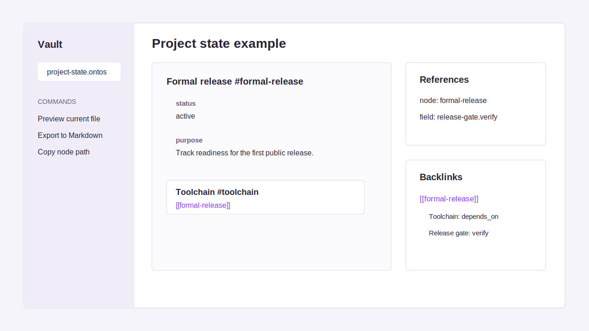

# .ontos Protocol Obsidian Plugin

Obsidian support for `.ontos` files.



Features:

- recognizes `.ontos` files
- edits files as plain text
- renders a collapsible preview
- resolves `[[node-id]]` references in preview
- shows backlinks where possible
- exports current file to Markdown
- adds command palette actions
- provides a settings tab

Build locally:

```bash
npm run validate:obsidian
```

Community submission preparation is tracked in
[`COMMUNITY_SUBMISSION.md`](COMMUNITY_SUBMISSION.md).
