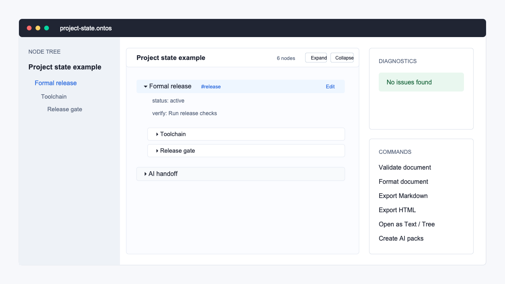

# .ontos Protocol VS Code Extension

Node-first VS Code support for `.ontos` files.



## Install

Install `.ontos Protocol` from Open VSX, Cursor, VSCodium, or Visual Studio
Marketplace after publication. Maintainers can build and install the release
VSIX locally:

```bash
npm run release:vscode-vsix
code --install-extension .release/ontos-protocol-vscode-1.0.3.vsix
```

See the repository-level
[VS Code Extension Publishing](../../docs/VSCODE_PUBLISHING.md) runbook for
Open VSX and Visual Studio Marketplace publishing.

Features:

- default tree custom editor for `.ontos` files
- automatic switch from a text tab to the tree view when `ontos.defaultEditor`
  is `tree`
- automatic migration of restored `.ontos` text tabs from older Cursor/VS Code
  sessions into the tree editor
- Open as Text and Open as Tree commands
- optional Node Tree side view
- `.ontos` language registration
- syntax highlighting
- document symbols and outline
- validation diagnostics
- format command
- export commands for Markdown, HTML, JSON, and OPML
- copy node ID, node path, and node text commands
- context, review, handoff, modify-boundary, and verification pack commands
- Markdown to `.ontos` conversion command
- optional interactive tree preview command

Node path, node text, and AI pack commands work from the current tree tab
focus, Node Tree selection, or text cursor. These commands also work before a
node has `@id(...)`; packs for no-ID nodes include a temporary line-based
reference and recommend adding a stable ID.

## First Open Behavior

`.ontos` opens in `.ontos Tree` by default:

- `ontos.defaultEditor` defaults to `tree`.
- The extension contributes `workbench.editorAssociations` so `*.ontos` uses
  `ontos.nativeViewer`.
- Workspace opens are the most reliable path for editor associations because
  VS Code applies workspace and extension defaults together.
- Single-file opens still promote a plain text `.ontos` tab into the tree view
  when `ontos.defaultEditor` is `tree`.

Use `.ontos: Open as Text` or set `ontos.defaultEditor` to `text` for a
plain-text-only workflow.

UI layers:

1. Default: `.ontos Tree` custom editor in the main editor tab.
2. Optional: Node Tree side view, controlled by `ontos.focusSidebarOnOpen`.
3. Optional: side Web Preview, controlled by `ontos.autoPreview` or the preview
   command.

Settings:

- `ontos.defaultEditor`: `tree` by default, or `text` for plain text opening
- `ontos.autoPreview`: disabled by default; opens the optional side preview
- `ontos.focusSidebarOnOpen`: disabled by default; focuses the Node Tree side view
- `ontos.indentGuides`: enabled by default for plain text mode
- `ontos.depthBands`: disabled by default; adds subtle nesting bands in plain text mode
- `ontos.textFolding`: disabled by default; enables native text-editor folding
  only for users who explicitly prefer it

The default experience is the tree custom editor. Use Open as Text when editing
source lines directly. Text mode suppresses VS Code's native folding gutter for
`.ontos` files so users do not see a second set of left-edge disclosure
controls competing with the tree editor. If Cursor restores a `.ontos` text tab
from an older session, the extension migrates it back into `.ontos Tree` unless
`ontos.defaultEditor` is set to `text` or the current session used `.ontos: Open
as Text`.

Local development smoke check:

```bash
npm run validate:vscode
```

Manual release UX checklist:

- `docs/VSCODE_EXTENSION_MANUAL_UX_CHECKLIST.md`
